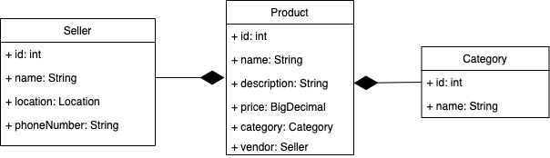
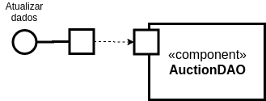

# Projeto Marketplace <!-- omit in toc -->

# Equipe <!-- omit in toc -->
- Aruã Puertas
- Daniela Bouwman
- Guilherme Kayo Shida
- Nicholas Borba
- Simeão Lamine

# Sumário  <!-- omit in toc -->

- [Nível 1](#nível-1)
  - [Diagrama Geral do Nível 1](#diagrama-geral-do-nível-1)
  - [Componente `Buyer`](#componente-buyer)
  - [Componente `Product`](#componente-product)
  - [Componente `Order`](#componente-order)
  - [Componente `Payment`](#componente-payment)
  - [Componente `Seller`](#componente-seller)
  - [Componente `Shipping`](#componente-shipping)
  - [Componente `Recommendation`](#componente-recommendation)
  - [Componente `Auction`](#componente-auction)
- [Nível 2](#nível-2)
  - [Diagrama do Nível 2 - Componente Auction](#diagrama-do-nível-2---componente-auction)
  - [Componente `Gerenciar Leilão`](#componente-gerenciar-leilão)
  - [Componente `Manter Leilão`](#componente-manter-leilão)
  - [Componente `Gerenciar Lance`](#componente-gerenciar-lance)
  - [Componente `BuyerDAO`](#componente-buyerdao)
  - [Componente `AuctionDAO`](#componente-auctiondao)
  - [Componente `SellerDAO`](#componente-sellerdao)
  - [Componente `ProductDAO`](#componente-productdao)
  - [Componente `Montar Telas Leilão`](#componente-montar-telas-leilão)
  - [Component `Formulário Novo Lance`](#component-formulário-novo-lance)
    - [Interface `IAuctionNewBid`](#interface-iauctionnewbid)
  - [Componente `Detalhar Leilão`](#componente-detalhar-leilão)
- [Multiplas Interfaces](#multiplas-interfaces)

# Nível 1

## Diagrama Geral do Nível 1

> 

### Detalhamento da interação de componentes  <!-- omit in toc -->

#### Processo de compra <!-- omit in toc -->

* O `componente Buyer` inicia o processo de compra publicando no barramento a mensagem de tópico `"product/search"` através da interface ISearch;
* O `componente Product` assina no barramento de mensagens de tópico `"product/search"` através da `interface ISearch`. Quando recebe uma mensagem, ele mostra os produtos;
* O `componente Buyer` seleciona um produto publicando no barramento a mensagem de tópico `"product/<id>/details"` através da `interface IProduct`;
* O `componente Product` assina no barramento de mensagens de tópico `"product/<id>/details"` através da `interface IProduct`. Quando recebe uma mensagem, ele mostra os dados do produto selecionado;
* O `componente Buyer` publica no barramento de mensagem de tópico `"order/<sellerId>/create/<produtoId>"` através da `interface IOrder` realizando o pedido;
* O `componente Order` assina no barramento de mensagens de tópico `"order/<sellerId>/create/<produtoId>"` através da `interface IOrder`. Quando recebe uma mensagem, ele cria um pedido e valida suas informações publicando no barramento de mensagem de tópico `"payment/check/<orderId>"` através da `interface IPayment`;
* O `componente Payment` assina no barramento de mensagens de tópico `"payment/check/<orderId>"` através da `interface IPayment`. Quando recebe a mensagem,  ele publica no barramento de mensagem de tópico `"payment/order/<orderId>/denied"` através da `interface IPayment` caso o pagamento não foi aprovado ou publica no barramento de mensagem de tópico `"payment/order/<orderId>/confirmed"` atráves da `interface IPayment` caso o pagamento foi confirmado;
* O `component Buyer` assina no barramento de mensagem de tópico `"payment/order/<orderId>/+"` através da `interface IPayment`. Quando recebe uma mensagem, ele verifica se o pedido foi confirmado ou negado;
* O `componente Seller` assina no barramento de mensagem de tópico `"payment/order/<orderId>/confirmed"` através da `interface IPayment`. Quando ele recebe a mensagem, dá início ao processo de envio do produto publicando no barramento de mensagem de tópico `"dispatcher/order/<orderId>"` através da `interface ISeller`;
* O `componente Shipping` assina no barramento de mensagem de tópico `"dispatcher/order/<orderId>"` através da `interface ISeller`. Quando recebe uma mensagem, ele publica no barramento de mensagens de tópico `"location/status"` através da `interface IShipping` atualizando o estado da entrega;
* O `component Buyer` assina no barramento de mensagem de tópico `"location/status"` através da `interface IShipping`. Quando recebe uma mensagem, exibe as informações da entrega;
* O `componente Seller` assina no barramento de mensagem de tópico `"location/status"` através da `interface IShipping`. Quando ele recebe a mensagem, atualiza as informações na base de dados;
* O `componente Recommendation` assina o tópico `"order/+/create/+"` atraveś da `interface IOrder` para monitorar os produtos mais requisitados e seus respectivos fornecedores afim de melhorar o seu algoritmo de recomendação. Além disso, também assina o tópico `"payment/order/+"` através da `interface IPayment` para entender qual é a forma de pagamento mais comum praticado pelos compradores.

#### Leilão Invertido <!-- omit in toc -->

* O `componente Buyer` inicia o processo de leilão publicando no barramento a mensagem de tópico `"auction/create"` através da `interface ICreateAuction`;
* O `componente Auction` assina no barramento de mensagem de tópico `"auction/create"` através da `interface ICreateAuction`. Quando ele recebe a mensagem, ele inicia o leilão com o produto que o comprador deseja e com um tempo limite publicando uma mensagem no barramento de tópico `"auction/<auctionId>/begin"` através da `interface IAuction`;
* O `componente Seller` assina no barramento de mensagem de tópico `"auction/<auctionId>/begin"` através da `interface IAuction`. Quando recebe uma mensagem, os fornecedores podem enviar seus lances para o produto desejado publicando no barramento de mensagens de tópico `"auction/<auctionId>/bid"` através da `interface IAuction`;
* O `componente Auction` assina no barramento de mensagem de tópico `"auction/<auctionId>/bid"` através da `interface IAuction`. Quando recebe uma mensagem, o leilão monitora os lances do leilão;
* O `componente Seller` assina no barramento de mensagem de tópico `"auction/<auctionId>/bid"` através da `interface IAuction`. Quando recebe uma mensagem, o fornecedor verifica o novo lance do fornecedor concorrente e determina se vai oferecer um valor menor publicando outra mensagem no barramento usando o mesmo tópico e interface;
* O `componente Buyer` assina no barramento de mensagem de tópico `"auction/<auctionId>/bid"` através da `interface IAuction`. Quando recebe uma mensagem, o comprador pode ver os lances do leilão;
* O `componente Auction` informa o final do leilão publicando uma mensagem no barramento de tópico `"auction/<auctionId>/finish"` através da `interface IAuction`;
* O `componente Buyer` assina no barramento de mensagem de tópico `"auction/<auctionId>/finish"` através da `interface IAuction`. Quando recebe uma mensagem, o comprador pode ver lance final;
* O `componente Seller` assina no barramento de mensagem de tópico `"auction/<auctionId>/finish"` através da `interface IAuction`. Quando recebe uma mensagem, informa ao fornecedor que ofereceu o menor lance que ele ganhou o leilão;
* O `componente Recommendation` assina o tópico `"auction/+/finish"` atraveś da `interface IAuction` para monitorar o produto, o menor preço e o fornecedor.

## Componente `Buyer`

Este componente é responsável por administrar as funções relativas ao comprador. Seus serviços são procurar por um produto, selecionar um produto, iniciar um pedido e iniciar um leilão.

**Interfaces**
* ISearch;
* IProduct;
* IOrder;
* IPayment;
* IShipping;
* ICreateAuction;
* IAuction.

As interfaces listadas são detalhadas a seguir:

## Detalhamento das Interfaces <!-- omit in toc -->

### Interface `ISearch` <!-- omit in toc -->

Esta interface é uma fonte de dados para busca de produtos.

**Tópico**: `product/search`

Classes que representam objetos JSON associados às mensagens da interface:

~~~json
{
  "term": "camisetas",
  "price_range": {
    "min": 50.0,
    "max": 300.0
  },
  "category_id": 2,
  "brand_id": 3
}
~~~

Detalhamento da mensagem JSON:

**Query**

Atributo | Descrição
-------| --------
`term` | `O termo para fazer uma busca por produtos`
`price_range` | `O intervalo de preço do produto`
`category_id` | `O id da categoria de produto`
`brand_id` | `O id da marca de produto`

**Price Range**

Atributo | Descrição
-------| --------
`min` | `O preço mínimo do produto`
`max` | `O preço máximo do produto`

### Interface `IProduct` <!-- omit in toc -->

Esta interface é uma fonte de dados para ver os detalhes de um produto.

**Tópico**: `product/{id}/details`

Classes que representam objetos JSON associados às mensagens da interface:

~~~json
{
  "id": 9
}
~~~

Detalhamento da mensagem JSON:

Atributo | Descrição
-------| --------
`id` | `O id do produto para ver os detalhes`

### Interface `IOrder` <!-- omit in toc -->

Esta interface é uma fonte que dispara um evento para iniciar um pedido.

**Tópico**: `order/{sellerId}/create/{produtoId}`

Classes que representam objetos JSON associados às mensagens da interface:

~~~json
{
  "sellerId": 9,
  "produtoId": 9,
  "qty": 1
}
~~~

Detalhamento da mensagem JSON:

Atributo | Descrição
-------| --------
`sellerId` | `O id do fornecedor que está vendendo o produto`
`produtoId` | `O id do produto será feito o pedido`

### Interface `IPayment` <!-- omit in toc -->

Esta interface escuta um evento para verificar se o pagamento de um pedido foi negado ou aprovado.

**Tópico**: `payment/order/<orderId>/+`

Classes que representam objetos JSON associados às mensagens da interface:

~~~json
{
  "transactionId": 007,
  "order": 2020411456,
  "paymentType": "Credit",
  "dataPagamento": "2020-09-18",
  "totalCost": 100.00,
  "status": "aprovado"
}
~~~

Detalhamento da mensagem JSON:

Atributo | Descrição
-------         | --------
`transactionId` | `identificador da transação de pagamento`
`order`         | `numero da ordem que está sendo paga nessa transação`
`paymentType`   | `forma de pagamento (crédito, debito, boleto)`
`date`          | `data da transação`
`totalCost`     | `preço final do pagamento`
`status`        | `aprovado ou recusado`

### Interface `IShipping` <!-- omit in toc -->

Esta interface escuta sobre o tópico atualizações sobre o estado da entrega.

**Tópico**: `location/status`

Detalhes da interface encontra-se disponível em [Interface IShipping](#interface-ishipping--2)

### Interface `ICreateAuction` <!-- omit in toc -->

Esta interface é uma fonte que dispara um evento para um comprador criar um leilão com um produto de interesse.

**Tópico**: `auction/create`

Classes que representam objetos JSON associados às mensagens da interface:

~~~json
{
  "productId": 9,
  "qty": 500,
  "buyer": {
    "id": 9,
    "name": "SuperBuyer",
  }
}
~~~

Detalhamento da mensagem JSON:

**CreateAuction**

Atributo | Descrição
-------| --------
`productId` | `O id do produto de interesse`
`qty` | `A quantidade que o comprador está interessado`
`buyer` | `As informações do comprador`

**Buyer**

Atributo | Descrição
-------| --------
`id` | `O id do comprador`
`name` | `O nome do comprador`

### Interface `IAuction` <!-- omit in toc -->

Esta interface escuta as atualizações do leilões que o comprador está participando.

**Tópico 1**: `auction/{auctionId}/bid`
**Tópico 2**: `auction/{auctionId}/finish`

Detalhes da interface encontra-se disponível em [Interface IAuction](#interface-iauction--3)

## Componente `Product`

> Este componente é responsável por fornecer todos os detalhes referente a um dado produto registrado na base da plataforma.

**Interfaces**
> * ISearch;
> * IProduct.

As interfaces listadas são detalhadas a seguir:

## Detalhamento das Interfaces <!-- omit in toc -->

### Interface `ISearch` <!-- omit in toc -->

> Detalhes da interface ISearch como JSON de request e a descrição da interface podem ser encontradas `aqui` (Interface ISearch).

**Tópico**: `product/search`

### Interface `IProduct` <!-- omit in toc -->

product/<id>/details

Classes que representam objetos JSON associados às mensagens da interface:

*JSON de resposta*
~~~json
{
  "id": 10,
  "name": "Camiseta Polo",
  "description": "blah blah blah blah",
  "price": 200,
  "qty": 5,
  "category": {
    "id": 1,
    "name": "Vestuário",
  },
  "vendor": {
    "id": 1,
    "name": "Loja X",
    "location": {
        "address": "Rua xyz, Campinas-SP",
        "cep" : 13897-000,
      },
    "phoneNumber": "(00) 00000-0000"
  }

}
~~~

Detalhamento da mensagem JSON:

Atributo      | Descrição
--------------| --------
`id`          | `Idenficador do produto na base de dados da plataforma`
`name`        | `Nome do produto`,
`description` | `Detalhes do produto`
`price`       | `Preço único do produto`,
`qty`  | `Quantidade de produtos disponível na loja`
`category`    | `Categoria em que o produto se enquadra`
`vendor`      | `informações do vendedor`

**category**
Atributo  | Descrição
----------| --------
`id`      | `Identificador único da categoria do produto`
`name`    | `Nome da categoria em que o produto se enquadra`

**vendor**
Atributo      | Descrição
--------------| --------
`id`          | `Identificador único do forncedor`
`name`        | `Nome do fornecedor/vendedor`
`locationt`   | `Endereço da loja (caso apenas virtual, o endereço de devolução`
`phoneNumber` | `Telefone de contato do fornecedor`

**location**
Atributo      | Descrição
--------------| --------
`address` | `Nome da Rua e número de identificação`
`cep`     | `CEP da Rua`

## Componente `Order`

Este componente é responsável por administrar as funções relativas aos pedidos. Seus serviços são criar e validar um pedido e verificar o estado do pagamento.

**Interfaces**
> * IOrder;
> * IPayment.

As interfaces listadas são detalhadas a seguir:

## Detalhamento das Interfaces <!-- omit in toc -->

### Interface `IOrder` <!-- omit in toc -->

Esta interface escuta o tópico para criar e validar um pedido.

**Tópico**: `order/{sellerId}/create/{produtoId}`

Classes que representam objetos JSON associados às mensagens da interface:

~~~json
{
  "orderId": 9,
  "items": [
    {
      "productId": 9,
      "name": "Camiseta Polo",
      "description": "blah blah blah blah",
      "price": 200.0,
      "qty": 5,
    }
  ],
  "total": 1000.0,
  "categoryId": 1,
  "sellerId": 1
}
~~~

Detalhamento da mensagem JSON:

**Order**

Atributo | Descrição
-------| --------
`orderId` | `O id do novo pedido`
`items` | `Os itens do pedido`
`total` | `O total do pedido`
`categoryId` | `O id da categoria do produto`
`sellerId` | `O id do fornecedor que vende o produto`

**Item**

Atributo | Descrição
-------| --------
`productId` | `O id do produto`
`name` | `O nome do produto`
`description` | `A descrição do produto`
`price` | `O preço unitário do produto`
`qty` | `O quantidade de produtos do produto`

### Interface `IPayment` <!-- omit in toc -->

Esta interface dispara um evento para validar o pagamento do pedido.

**Tópico**: `payment/check/{orderId}`

Detalhes da interface encontra-se disponível em [Interface IPayment](#interface-ipayment--2)

## Componente `Payment`

Payment é o componente que efetua o pagamento de um pedido realizado, verificando se o pagamento foi ou não aprovado.

**Interfaces**
> * IPayment.

As interfaces listadas são detalhadas a seguir:

## Detalhamento das Interfaces <!-- omit in toc -->

### Interface `IPayment` <!-- omit in toc -->

> Resumo do papel da interface.

**Tópico**: `payment/check/{orderId}`

Classes que representam objetos JSON associados às mensagens da interface:

 

~~~json
{
  "transactionId": 007,
  "order": 2020411456,
  "paymentType": "Credit",
  "dataPagamento": "2020-09-18",
  "totalCost": 100.00,
  "status": "aprovado"
  }
~~~

Detalhamento da mensagem JSON:

Atributo | Descrição
-------         | --------
`transactionId` | `identificador da transação de pagamento`
`order`         | `numero da ordem que está sendo paga nessa transação`
`paymentType`   | `forma de pagamento (crédito, debito, boleto)`
`date`          | `data da transação`
`totalCost`     | `preço final do pagamento`
`status`        | `aprovado ou recusado`

&nbsp;

## Componente `Seller`

Este componente é responsável por administrar as funções de um fornecedor. Seus serviços são iniciar o envio do produto e participar dos leilões.

**Interfaces**
> * ISeller;
> * IPayment;
> * IShipping;
> * IAuction.

As interfaces listadas são detalhadas a seguir:

## Detalhamento das Interfaces <!-- omit in toc -->

### Interface `ISeller` <!-- omit in toc -->

Esta interface é responsável por publicar um evento de despacho de produto.

**Tópico**: `dispatcher/order/{orderId}`

Classes que representam objetos JSON associados às mensagens da interface:

~~~json
{
  "orderId": 20,
  "sellerId": 9,
  "location": {
    "zipcode": "99999-999",
    "address": "Avenida Paulista",
    "state": "São Paulo",
    "city": "São Paulo"
  }
}
~~~

Detalhamento da mensagem JSON:

**Dispatch**

Atributo | Descrição
-------| --------
`orderId` | `O id do pedido`
`sellerId` | `O id do fornecedor`
`location` | `A localização da entrega`

**Location**

Atributo | Descrição
-------| --------
`zipcode` | `O cep do endereço`
`address` | `O endereço`
`state` | `O estado do endereço`
`city` | `A cidade do endereço`

### Interface `IPayment` <!-- omit in toc -->

Esta interface escuta no tópico para verificar um pedido desse fornecedor que foi aprovado.

**Tópico**: `payment/order/{orderId}/confirmed`

Classes que representam objetos JSON associados às mensagens da interface:

 

~~~json
{
  "transactionId": 007,
  "order": 2020411456,
  "paymentType": "Credit",
  "dataPagamento": "2020-09-18",
  "totalCost": 100.00,
  "status": "aprovado",
  "sellerId": 1
}
~~~

Detalhamento da mensagem JSON:

Atributo | Descrição
-------         | --------
`transactionId` | `identificador da transação de pagamento`
`order`         | `numero da ordem que está sendo paga nessa transação`
`paymentType`   | `forma de pagamento (crédito, debito, boleto)`
`date`          | `data da transação`
`totalCost`     | `preço final do pagamento`
`status`        | `aprovado ou recusado`
`sellerId`      | `O id do fornecedor`

### Interface `IShipping` <!-- omit in toc -->

Esta interface escuta sobre o tópico atualizações sobre o estado da entrega.

**Tópico**: `location/status`

Detalhes da interface encontra-se disponível em [Interface IShipping](#interface-ishipping--2)

### Interface `IAuction` <!-- omit in toc -->

Esta interface escuta sobre o tópico de inicio de leilão. Além disso, ele dispara eventos participando dos leilões com lances sobre um determinado produto.

**Tópico**: `auction/<auctionId>/begin` e `auction/<auctionId>/bid`

Detalhes da interface encontra-se disponível em [Interface IAuction](#interface-iauction--3)

## Componente `Shipping`

Esse componente é responsável por administrar as funções relativas a entrega. Seus serviços são criação da entrega e atualização de estado.

**Interfaces**
* IShipping;
* ISeller.

As interfaces listadas estão detalhadas a seguir:

## Detalhamento das Interfaces <!-- omit in toc -->

### Interface `IShipping` <!-- omit in toc -->

Essa interface é um fonte de dados sobre a entrega, ela publica o estado da entrega de um pedido.

**Tópico**: `location/status`

Classes que representam objetos JSON associados às mensagens da interface:

~~~json
{
  "id": "440",
  "status": "entregue",
  "location": {
    "zipcode": "99999-999",
    "address": "Avenida Paulista",
    "state": "São Paulo",
    "city": "São Paulo"
  },
  "order": {
    "sellerId": "781",
    "productId": "50",
    "qty": "2"  
  }     
}
~~~

Detalhamento da mensagem JSON:

**Shipping**

Atributo | Descrição
-------| --------
`id` | `O id da entrega`
`status` | `O estado da entrega`
`location` | `A localização de envio`

**Order**

Atributo | Descrição
-------| --------
`seller_id` | `O id do fornecedor`
`product_id` | `O id do produto`
`qty` | `A quantidade ser enviada`

### Interface `ISeller` <!-- omit in toc -->

Essa interface escuta no tópico um evento de despachar um produto e cria uma entrega

**Tópico**: `<dispatcher/order/{orderId}>`

Classes que representam objetos JSON associados às mensagens da interface:

~~~json
{
  "id": "440",
  "status": "entregue",
  "location": {
    "zipcode": "99999-999",
    "address": "Avenida Paulista",
    "state": "São Paulo",
    "city": "São Paulo"
  },
  "order": {
    "sellerId": "781",
    "productId": "50",
    "qty": "2"  
  }     
}
~~~

Detalhamento da mensagem JSON:

**Shipping**

Atributo | Descrição
-------| --------
`id` | `O id da entrega`
`status` | `O estado da entrega`
`location` | `A localização de envio`

**Order**

Atributo | Descrição
-------| --------
`seller_id` | `O id do fornecedor`
`product_id` | `O id do produto`
`qty` | `A quantidade ser enviada`

## Componente `Recommendation`

Este componente é responsável por recomendar produtos aos clientes da plataforma. Ele possui algoritmos que permite classificar e recomendar produtos baseados em gosto, frequetemente visualizados, etc.

**Interfaces**
* IOrder;
* IPayment;
* IAuction.

As interfaces listadas são detalhadas a seguir:

## Detalhamento das Interfaces <!-- omit in toc -->
O Componente Recomendation assina os tópicos abaixo detalhado para monitorar e enriquecer o datawarehouse afim de melhorar o algoritmo de recomendação através dessas interfaces.

### Interface `IOrder` <!-- omit in toc -->

Detalhes da interface encontra-se disponível em [Interface IOrder](#interface-iorder--1)

**Tópico**: `order/+/create/+`

### Interface `IPayment` <!-- omit in toc -->

Detalhes da interface encontra-se disponível em [Interface IPayment](#interface-ipayment--2) 

**Tópico**: `payment/order/+`

### Interface `IAuction` <!-- omit in toc -->

**Tópico**: `auction/{auctionId}/finish`

Detalhes da interface encontra-se disponível em [Interface IAuction](#interface-iauction--3)

## Componente `Auction`

Esse componente recebe um determinado produto de um cliente, além disso inicia e termina o processo de leilão invertido.

**Interfaces**
* IAuction;
* ICreateAuction;

As interfaces listadas são detalhadas a seguir:

## Detalhamento das Interfaces <!-- omit in toc -->

### Interface `IAuction` <!-- omit in toc -->

Essa interface é responsável por atualizar e manter o processo de leilão, permitindo aos Sellers cadastrarem propostas.

**Tópico**: `auction/<auctionId>/bid` e `auction/{auctionId}/finish`

Classes que representam objetos JSON associados às mensagens da interface:

~~~json
{
  "auctionId": 01654,
  "productId": 1000001,
  "lowerBid": 259.90,
  "sellerId": 300004,
  "bidHistory": 
  	{
  	  "sellerId": 30004,
  	  "bid": 259.90
  	}
  	{
  	  "sellerId": 30006,
  	  "bid": 289.00
  	}
  }
~~~

Detalhamento da mensagem JSON:

Atributo | Descrição
-------| --------
`auctionId` | `número único do leilão`
`product` | `Produto desejado`
`lowerBid` | `registra o lance mais baixo registrado`
`seller` | `registra o Seller com Bid mais baixo proposto`
`bidHistory` | `registra os lances efetuados registrando o Seller e o Bid proposto`

### Interface `ICreateAuction` <!-- omit in toc -->

Essa interface é responsável pela criação de um novo leilão, vinculando um Buyer a ele e um Produto.

**Tópico**: `auction/<auctionId>/begin`

Classes que representam objetos JSON associados às mensagens da interface:

~~~json
{
  "auctionId": 01654,
  "productId": 1000001,
  "lowerBid": null,
  "sellerId": null,
  "bidHistory": { }
  }
~~~

Detalhamento da mensagem JSON:

Atributo | Descrição
-------| --------
`auctionId` | `define um número único para o leilão`
`product` | `armazena o Produto desejado`
`lowerBid` | `registrará o lance mais baixo registrado`
`seller` | `registrará o Seller com Bid mais baixo proposto`
`bidHistory` | `registrará os lances efetuados registrando o Seller e o Bid proposto`

&nbsp;

# Nível 2

## Diagrama do Nível 2 - Componente Auction

> 

### Detalhamento da interação de componentes <!-- omit in toc -->

#### Criação de leilão <!-- omit in toc -->

* O componente `Auction Controller` assina no barramento de mensagens de tópico `"auction/create"` através da `interface ICreateAuction`.
  * Ao receber uma mensagem neste tópico, dispara o início de um leilão.
  * Internamente este evento é atendido por uma interface provida do componente `Gerenciar Leilão`, que é responsável por administrar os leilões.
    * Este componente cria um novo leilão acionando o componente `Manter Leilão` através da `interface IManageAuction`.
    * O componente `Manter Leilão` acessa os componentes de Model associados através da interface requerida externa `Atualizar Dados`.
    * Iniciado o leilão, o componente `Manter Leilão` notifica externamente para o barramento de tópico `"auction/<auctionId>/begin"` que é possível fazer lances através da `interface IAuction`.
* O componente `Auction View` assina no barramento de mensagens de tópico `"auction/<auctionId>/begin"` através da `interface ICreateAuction`.
  * Ao receber uma mensagem neste tópico, dispara a possibilidade de vendedores realizarem lances para o leilão.
  * Internamente este evento é atendido por uma interface provida do componente `Montar telas leilão`, que é responsável por montar as telas de leilão.
    * Este componente mostra os detalhes do leilão através do componente `Detalhar o Leilão` através da `interface IAuctionDetails`.

#### Lances <!-- omit in toc -->

* Para fazer um novo lance, o componente `Montar telas leilão` pede ao componente `Formulário Novo Lance` através da `interface IAuctionNewBid` os dados do novo lance.
  * Ao receber os dados, o componente `Montar telas leilão` publica os dados externamente no barramento pelo tópico `"auction/<auctionId>/bid"` através da mesma `interface IAuction`.
* O componente `Auction Controller` assina no barramento de mensagens de tópico `"auction/<auctionId>/bid"` através da `interface IAuction`.
  * Ao receber uma mensagem neste tópico, dispara o gerenciamento os lances.
  * Este componente gerencia os lances acionando o componente `Gerenciar Lance` através da `interface IAuctionBid`.
  * O componente `Gerenciar Lance` atualiza os componentes de cada Model associados através da interface requerida externa `Atualizar Dados`. Além disso, para cada lance este mesmo componente publica no barramento externo de tópico `"auction/<auctionId>/bid"` através da `interface IAuction` a atualização dos lances.
* O componente `Auction View` assina no barramento de mensagens de tópico `"auction/<auctionId>/bid"` através da `interface IAuction`.
  * Ao receber uma mensagem neste tópico, os leilões são atualizados.
  * Internamente este evento é atendido por uma interface provida do componente `Montar telas leilão`, que é responsável por montar as telas de leilão.
    * Este componente mostra as atualizações do leilão através do componente `Detalhar o Leilão` através da `interface IAuctionDetails`.

#### Término de leilão <!-- omit in toc -->

* O componente `Auction Controller` publica no barramento de mensagens de tópico `"auction/<auctionId>/finish"` através da `interface IAuction`.
* O componente `Auction View` assina no barramento de mensagens de tópico `"auction/<auctionId>/finish"` através da `interface IAuction`.
  * Ao receber uma mensagem neste tópico, dispara o término de um leilão.
  * Internamente este evento é atendido por uma interface provida do componente `Montar telas leilão`, que é responsável por montar as telas de leilão.
    * Este componente anuncia o término do leilão através do componente `Detalhar o Leilão` através da `interface IAuctionDetails`.

## Componente `Gerenciar Leilão`
 
Este componente é responsável por gerenciar os leilões no controller.
 

 
**Interfaces**
* IAuction
* ICreateAuction
 
As interfaces listadas são detalhadas a seguir:
 
## Detalhamento das Interfaces <!-- omit in toc -->
 
### Interface `IAuction` <!-- omit in toc -->

Detalhes da interface encontra-se disponível em [Interface IAuction](#interface-iauction--3)

### Interface `ICreateAuction` <!-- omit in toc -->

Detalhes da interface encontra-se disponível em [Interface ICreateAuction](#interface-icreateauction--1)

## Componente `Manter Leilão`

Este componente é responsável criar e terminar um leilão internamente no controller.

**Interfaces**
* IManageAuction
* IAuction

As interfaces listadas são detalhadas a seguir:

## Detalhamento das Interfaces <!-- omit in toc -->

### Interface `IManageAuction` <!-- omit in toc -->

Esta interface fornece os métodos para criar e terminar um leilão.

Método | Objetivo
-------| --------
`createAuction(productId)` | `Cria um novo leilão passando o id do produto`
`terminateAuction(auctionId)` | `Termina um leilão passando o id do leilão`

### Interface `IAuction` <!-- omit in toc -->

Detalhes da interface encontra-se disponível em [Interface IAuction](#interface-iauction--3)

## Componente `Gerenciar Lance`

Este componente é responsável por gerenciar os lances dos leilões.

**Interfaces**
* IAuctionBid
* IAuction

As interfaces listadas são detalhadas a seguir:

## Detalhamento das Interfaces <!-- omit in toc -->

### Interface `IAuctionBid` <!-- omit in toc -->

Esta interface fornece os métodos registrar os lances.

Método | Objetivo
-------| --------
`registrarLance(auctionId)` | `Método para registrar os lances do leilão passando o id do leilão`

### Interface `IAuction` <!-- omit in toc -->

Detalhes da interface encontra-se disponível em [Interface IAuction](#interface-iauction--3)

## Componente `BuyerDAO`

Este componente representa o modelo de entidade do comprador.

**Interfaces**
* Atualizar dados

As interfaces listadas são detalhadas a seguir:

## Detalhamento das Interfaces <!-- omit in toc -->

### Interface `Atualizar dados` <!-- omit in toc -->

Esta interface fornece os métodos para acessar/alterar os dados desta entidade. Os métodos são os típicos `get` e `set` de um DAO.

## Componente `AuctionDAO`

Este componente representa o modelo de entidade do leilão.

**Interfaces**
* Atualizar dados

As interfaces listadas são detalhadas a seguir:

## Detalhamento das Interfaces <!-- omit in toc -->

### Interface `Atualizar dados` <!-- omit in toc -->

Detalhes da interface encontra-se disponível em [Interface Atualizar dados](#interface-atualizar-dados--1)

## Componente `SellerDAO`

Este componente representa o modelo de entidade do fornecedor.

**Interfaces**
* Atualizar dados

As interfaces listadas são detalhadas a seguir:

## Detalhamento das Interfaces <!-- omit in toc -->

### Interface `Atualizar dados` <!-- omit in toc -->

Detalhes da interface encontra-se disponível em [Interface Atualizar dados](#interface-atualizar-dados--1)

## Componente `ProductDAO`

Este componente representa o modelo de entidade do produto.

**Interfaces**
* Atualizar dados

As interfaces listadas são detalhadas a seguir:

## Detalhamento das Interfaces <!-- omit in toc -->

### Interface `Atualizar dados` <!-- omit in toc -->

Detalhes da interface encontra-se disponível em [Interface Atualizar dados](#interface-atualizar-dados--1)

## Componente `Montar Telas Leilão`

Esse componente é responsável por montar as telas do leilão. 

**Interfaces**
* IAuction
* ICreateAuction

As interfaces listadas são detalhadas a seguir:

## Detalhamento das Interfaces <!-- omit in toc -->
 
### Interface `IAuction` <!-- omit in toc -->

Detalhes da interface encontra-se disponível em [Interface IAuction](#interface-iauction--3).

Além disso, o seguinte método é disponível.

Método | Objetivo
-------| --------
`criarTela()` | `Método para criar telas do leilão`

### Interface `ICreateAuction` <!-- omit in toc -->

Detalhes da interface encontra-se disponível em [Interface ICreateAuction](#interface-icreateauction--1)

## Component `Formulário Novo Lance`

Esse componente é responsável por montar os formulários do leilão. 

**Interfaces**
* IAuctionNewBid

As interfaces listadas são detalhadas a seguir:

## Detalhamento das Interfaces <!-- omit in toc -->
 
### Interface `IAuctionNewBid` <!-- omit in toc  -->

Essa interface fornece os métodos para a criação do formulário novo lance.

Método | Objetivo
-------| --------
`createNewBid(auctionId)` | `Cria um novo lance para algum leilão`

## Componente `Detalhar Leilão`

Esse componente é responsável por montar os detalhes do leilão como atualização de lances. 

**Interfaces**
* IAuctionDetails

As interfaces listadas são detalhadas a seguir:

## Detalhamento das Interfaces <!-- omit in toc -->
 
### Interface `IAuctionDetails` <!-- omit in toc -->

Essa interface fornece os métodos para a montagem dos detalhes do leilão.

Método | Objetivo
-------| --------
`atualizarLeilao(auctionId)` | `Atualiza e monta os detalhes do leilão`

# Multiplas Interfaces

> Escreva um texto detalhando como seus componentes  podem ser preparados para que seja possível trocar de interface apenas trocando o componente View e mantendo o Model e Controller.
>
> É recomendado a inserção de, pelo menos, um diagrama que deve ser descrito no texto. O formato do diagrama é livre e deve ilustrar a arquitetura proposta.
