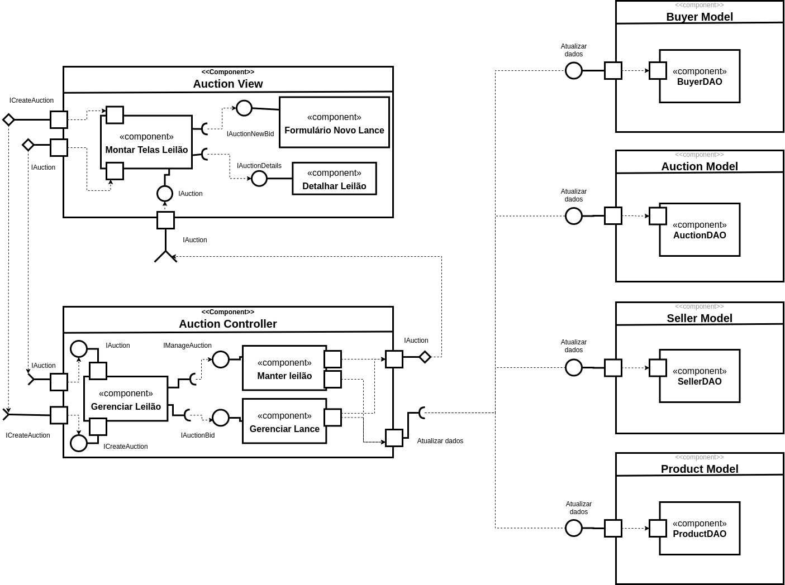

# Projeto Marketplace <!-- omit in toc -->

# Equipe <!-- omit in toc -->
- Aruã Puertas
- Daniela Bouwman
- Guilherme Kayo Shida
- Nicholas Borba
- Simeão Lamine

# Sumário  <!-- omit in toc -->

- [Nível 1](#nível-1)
  - [Diagrama Geral do Nível 1](#diagrama-geral-do-nível-1)
  - [Componente `Buyer`](#componente-buyer)
  - [Componente `Product`](#componente-product)
  - [Componente `Order`](#componente-order)
  - [Componente `Payment`](#componente-payment)
  - [Componente `Seller`](#componente-seller)
  - [Componente `Shipping`](#componente-shipping)
  - [Componente `Recommendation`](#componente-recommendation)
  - [Componente `Auction`](#componente-auction)
- [Nível 2](#nível-2)
  - [Diagrama do Nível 2](#diagrama-do-nível-2)
  - [Componente `<Nome do Componente>`](#componente-nome-do-componente)
- [Multiplas Interfaces](#multiplas-interfaces)

# Nível 1

## Diagrama Geral do Nível 1

> 

### Detalhamento da interação de componentes  <!-- omit in toc -->

#### Processo de compra <!-- omit in toc -->

* O `componente Buyer` inicia o processo de compra publicando no barramento a mensagem de tópico `"product/search"` através da interface ISearch;
* O `componente Product` assina no barramento de mensagens de tópico `"product/search"` através da `interface ISearch`. Quando recebe uma mensagem, ele mostra os produtos;
* O `componente Buyer` seleciona um produto publicando no barramento a mensagem de tópico `"product/<id>/details"` através da `interface IProduct`;
* O `componente Product` assina no barramento de mensagens de tópico `"product/<id>/details"` através da `interface IProduct`. Quando recebe uma mensagem, ele mostra os dados do produto selecionado;
* O `componente Buyer` publica no barramento de mensagem de tópico `"order/<fornecedorId>/create/<produtoId>"` através da `interface IOrder` realizando o pedido;
* O `componente Order` assina no barramento de mensagens de tópico `"order/<fornecedorId>/create/<produtoId>"` através da `interface IOrder`. Quando recebe uma mensagem, ele cria um pedido e valida suas informações publicando no barramento de mensagem de tópico `"payment/check/<orderId>"` através da `interface IPayment`;
* O `componente Payment` assina no barramento de mensagens de tópico `"payment/check/<orderId>"` através da `interface IPayment`. Quando recebe a mensagem,  ele publica no barramento de mensagem de tópico `"payment/order/<orderId>/denied"` através da `interface IPayment` caso o pagamento não foi aprovado ou publica no barramento de mensagem de tópico `"payment/order/<orderId>/confirmed"` atráves da `interface IPayment` caso o pagamento foi confirmado;
* O `component Buyer` assina no barramento de mensagem de tópico `"payment/order/<orderId>/+"` através da `interface IPayment`. Quando recebe uma mensagem, ele verifica se o pedido foi confirmado ou negado;
* O `componente Seller` assina no barramento de mensagem de tópico `"payment/order/<orderId>/confirmed"` através da `interface IPayment`. Quando ele recebe a mensagem, dá início ao processo de envio do produto publicando no barramento de mensagem de tópico `"dispatcher/order/<orderId>"` através da `interface ISeller`;
* O `componente Shipping` assina no barramento de mensagem de tópico `"dispatcher/order/<orderId>"` através da `interface ISeller`. Quando recebe uma mensagem, ele publica no barramento de mensagens de tópico `"location/status"` através da `interface IShipping` atualizando o estado da entrega;
* O `component Buyer` assina no barramento de mensagem de tópico `"location/status"` através da `interface IShipping`. Quando recebe uma mensagem, exibe as informações da entrega;
* O `componente Seller` assina no barramento de mensagem de tópico `"location/status"` através da `interface IShipping`. Quando ele recebe a mensagem, atualiza as informações na base de dados;
* O `componente Recommendation` assina o tópico `"order/create"` atraveś da `interface IOrder` para monitorar os produtos mais requisitados e seus respectivos fornecedores afim de melhorar o seu algoritmo de recomendação. Além disso, também assina o tópico `"payment/order/+"` através da `interface IPayment` para entender qual é a forma de pagamento mais comum praticado pelos compradores.

#### Leilão Invertido <!-- omit in toc -->

* O `componente Buyer` inicia o processo de leilão publicando no barramento a mensagem de tópico `"auction/create"` através da `interface ICreateAuction`;
* O `componente Auction` assina no barramento de mensagem de tópico `"auction/create"` através da `interface ICreateAuction`. Quando ele recebe a mensagem, ele inicia o leilão com o produto que o comprador deseja e com um tempo limite publicando uma mensagem no barramento de tópico `"auction/<auctionId>/begin"` através da `interface IAuction`;
* O `componente Seller` assina no barramento de mensagem de tópico `"auction/<auctionId>/begin"` através da `interface IAuction`. Quando recebe uma mensagem, os fornecedores podem enviar seus lances para o produto desejado publicando no barramento de mensagens de tópico `"auction/<auctionId>/bid"` através da `interface IAuctionBid`;
* O `componente Auction` assina no barramento de mensagem de tópico `"auction/<auctionId>/bid"` através da `interface IAuctionBid`. Quando recebe uma mensagem, o leilão monitora os lances do leilão;
* O `componente Seller` assina no barramento de mensagem de tópico `"auction/<auctionId>/bid"` através da `interface IAuctionBid`. Quando recebe uma mensagem, o fornecedor verifica o novo lance do fornecedor concorrente e determina se vai oferecer um valor menor publicando outra mensagem no barramento usando o mesmo tópico e interface;
* O `componente Buyer` assina no barramento de mensagem de tópico `"auction/<auctionId>/bid"` através da `interface IAuctionBid`. Quando recebe uma mensagem, o comprador pode ver os lances do leilão;
* O `componente Auction` informa o final do leilão publicando uma mensagem no barramento de tópico `"auction/<auctionId>/finish"` através da `interface IAuction`;
* O `componente Buyer` assina no barramento de mensagem de tópico `"auction/<auctionId>/finish"` através da `interface IAuction`. Quando recebe uma mensagem, o comprador pode ver lance final;
* O `componente Seller` assina no barramento de mensagem de tópico `"auction/<auctionId>/finish"` através da `interface IAuction`. Quando recebe uma mensagem, informa ao fornecedor que ofereceu o menor lance que ele ganhou o leilão;
* O `componente Recommendation` assina o tópico `"auction/+/finish"` atraveś da `interface IAuction` para monitorar o produto, o menor preço e o fornecedor.

## Componente `Buyer`

Este componente é responsável por administrar as funções relativas ao comprador. Seus serviços são procurar por um produto, selecionar um produto, iniciar um pedido e iniciar um leilão.

**Interfaces**
* ISearch;
* IProduct;
* IOrder;
* IPayment;
* IShipping;
* ICreateAuction;
* IAuction.

As interfaces listadas são detalhadas a seguir:

## Detalhamento das Interfaces <!-- omit in toc -->

### Interface `ISearch` <!-- omit in toc -->

Esta interface é uma fonte de dados para busca de produtos.

**Tópico**: `product/search`

Classes que representam objetos JSON associados às mensagens da interface:

~~~json
{
  "term": "camisetas",
  "price_range": {
    "min": 50.0,
    "max": 300.0
  },
  "category_id": 2,
  "brand_id": 3
}
~~~

Detalhamento da mensagem JSON:

**Query**

Atributo | Descrição
-------| --------
`term` | `O termo para fazer uma busca por produtos`
`price_range` | `O intervalo de preço do produto`
`category_id` | `O id da categoria de produto`
`brand_id` | `O id da marca de produto`

**Price Range**

Atributo | Descrição
-------| --------
`min` | `O preço mínimo do produto`
`max` | `O preço máximo do produto`

### Interface `IProduct` <!-- omit in toc -->

Esta interface é uma fonte de dados para ver os detalhes de um produto.

**Tópico**: `product/{id}/details`

Classes que representam objetos JSON associados às mensagens da interface:

~~~json
{
  "id": 9
}
~~~

Detalhamento da mensagem JSON:

Atributo | Descrição
-------| --------
`id` | `O id do produto para ver os detalhes`

### Interface `IOrder` <!-- omit in toc -->

Esta interface é uma fonte que dispara um evento para iniciar um pedido.

**Tópico**: `order/{fornecedorId}/create/{produtoId}`

Classes que representam objetos JSON associados às mensagens da interface:

~~~json
{
  "fornecedorId": 9,
  "produtoId": 9,
  "qty": 1
}
~~~

Detalhamento da mensagem JSON:

Atributo | Descrição
-------| --------
`fornecedorId` | `O id do fornecedor que está vendendo o produto`
`produtoId` | `O id do produto será feito o pedido`

### Interface `IPayment` <!-- omit in toc -->

Esta interface escuta um evento para verificar se o pagamento de um pedido foi negado ou aprovado.

**Tópico**: `payment/order/<orderId>/+`

Classes que representam objetos JSON associados às mensagens da interface:

~~~json
{}
~~~

Detalhamento da mensagem JSON:

Atributo | Descrição
-------| --------
`<nome do atributo>` | `<objetivo do atributo>`

### Interface `IShipping` <!-- omit in toc -->

> Esta interface é responsável por requisitar a situação da entrega.

**Tópico**: `location/status`

Classes que representam objetos JSON associados às mensagens da interface:

~~~json
{
}
~~~

Detalhamento da mensagem JSON:

Atributo | Descrição
-------| --------
`<nome do atributo>` | `<objetivo do atributo>`

### Interface `ICreateAuction` <!-- omit in toc -->

Esta interface é uma fonte que dispara um evento para um comprador criar um leilão com um produto de interesse.

**Tópico**: `auction/create`

Classes que representam objetos JSON associados às mensagens da interface:

~~~json
{
  "productId": 9,
  "qty": 500,
  "buyer": {
    "id": 9,
    "name": "SuperBuyer",
  }
}
~~~

Detalhamento da mensagem JSON:

**CreateAuction**

Atributo | Descrição
-------| --------
`productId` | `O id do produto de interesse`
`qty` | `A quantidade que o comprador está interessado`
`buyer` | `As informações do comprador`

**Buyer**

Atributo | Descrição
-------| --------
`id` | `O id do comprador`
`name` | `O nome do comprador`

### Interface `IAuction` <!-- omit in toc -->

> Resumo do papel da interface.

**Tópico**: `<tópico que a respectiva interface assina ou publica>`

Classes que representam objetos JSON associados às mensagens da interface:

~~~json
<Formato da mensagem JSON associada ao objeto enviado/recebido por essa interface.>
~~~

Detalhamento da mensagem JSON:

Atributo | Descrição
-------| --------
`<nome do atributo>` | `<objetivo do atributo>`

## Componente `Product`

> Este componente é responsável por fornecer todos os detalhes referente a um dado produto registrado na base da plataforma.

**Interfaces**
> * ISearch;
> * IProduct.

As interfaces listadas são detalhadas a seguir:

## Detalhamento das Interfaces <!-- omit in toc -->

### Interface `ISearch` <!-- omit in toc -->

> Detalhes da interface ISearch podem ser encontradas [aqui](#Interface Search).

**Tópico**: `product/search`

Classes que representam objetos JSON associados às mensagens da interface:

*JSON de resposta*
~~~json
{
  "id": 10,
  "name": "Camiseta Polo",
  "description": "blah blah blah blah",
  "price": 200,
  "qtAvailble": 5,
  "category": {
    "id": 1
    "name": "Roupa",
  },
  "vendor": {
    "id": 1,
    "name": "Loja X",
    "location": {
        "name": "Rua xyz, Campinas-SP",
        "latitude": -10102542798
        "longitude": 18098431254
      },
    "phoneNumber": "(00) 00000-0000"
  }

}
~~~

Detalhamento da mensagem JSON:

Atributo | Descrição
-------| --------
`id` | `Idenficador do produto na base de dados da plataforma`
`name` | `Nome do produto`,
`description` | `Detalhes do produto`
`price`| `Preço único do produto`,
`qtAvailble` | `Quantidade de produtos disponível na loja`
`category`: `Categoria em que o produto se enquadra`
`vendor` | `informações do vendedor`

** 8category
**vendor**
Atributo | Descrição
`id` | `Identificador único do forncedor`
`name` | `Nome do fornecedor/vendedor`
`locationt`

### Interface `IProduct` <!-- omit in toc -->

> Resumo do papel da interface.

**Tópico**: `<tópico que a respectiva interface assina ou publica>`

Classes que representam objetos JSON associados às mensagens da interface:

~~~json
<Formato da mensagem JSON associada ao objeto enviado/recebido por essa interface.>
~~~

Detalhamento da mensagem JSON:

Atributo | Descrição
-------| --------
`<nome do atributo>` | `<objetivo do atributo>`

## Componente `Order`

Este componente é responsável por administrar as funções relativas aos pedidos. Seus serviços são criar e validar um pedido e verificar o estado do pagamento.

**Interfaces**
> * IOrder;
> * IPayment.

As interfaces listadas são detalhadas a seguir:

## Detalhamento das Interfaces <!-- omit in toc -->

### Interface `IOrder` <!-- omit in toc -->

Esta interface escuta o tópico para criar e validar um pedido.

**Tópico**: `order/{fornecedorId}/create/{produtoId}`

Classes que representam objetos JSON associados às mensagens da interface:

~~~json
{
  "orderId": 9,
  "items": [
    {
      "productId": 9,
      "name": "Camiseta Polo",
      "description": "blah blah blah blah",
      "price": 200.0,
      "qty": 5,
    }
  ],
  "total": 1000.0,
  "categoryId": 1,
  "sellerId": 1
}
~~~

Detalhamento da mensagem JSON:

**Order**

Atributo | Descrição
-------| --------
`orderId` | `O id do novo pedido`
`items` | `Os itens do pedido`
`total` | `O total do pedido`
`categoryId` | `O id da categoria do produto`
`sellerId` | `O id do fornecedor que vende o produto`

**Item**

Atributo | Descrição
-------| --------
`productId` | `O id do produto`
`name` | `O nome do produto`
`description` | `A descrição do produto`
`price` | `O preço unitário do produto`
`qty` | `O quantidade de produtos do produto`

### Interface `IPayment` <!-- omit in toc -->

> Resumo do papel da interface.

**Tópico**: `<tópico que a respectiva interface assina ou publica>`

Classes que representam objetos JSON associados às mensagens da interface:

~~~json
<Formato da mensagem JSON associada ao objeto enviado/recebido por essa interface.>
~~~

Detalhamento da mensagem JSON:

Atributo | Descrição
-------| --------
`<nome do atributo>` | `<objetivo do atributo>`

## Componente `Payment`

> <Resumo do papel do componente e serviços que ele oferece.>

**Interfaces**
> * IPayment.

As interfaces listadas são detalhadas a seguir:

## Detalhamento das Interfaces <!-- omit in toc -->

### Interface `IPayment` <!-- omit in toc -->

> Resumo do papel da interface.

**Tópico**: `<tópico que a respectiva interface assina ou publica>`

Classes que representam objetos JSON associados às mensagens da interface:

~~~json
<Formato da mensagem JSON associada ao objeto enviado/recebido por essa interface.>
~~~

Detalhamento da mensagem JSON:

Atributo | Descrição
-------| --------
`<nome do atributo>` | `<objetivo do atributo>`

## Componente `Seller`

> <Resumo do papel do componente e serviços que ele oferece.>

**Interfaces**
> * ISeller;
> * IPayment;
> * IShipping;
> * IAuction.

As interfaces listadas são detalhadas a seguir:

## Detalhamento das Interfaces <!-- omit in toc -->

### Interface `ISeller` <!-- omit in toc -->

> Resumo do papel da interface.

**Tópico**: `<tópico que a respectiva interface assina ou publica>`

Classes que representam objetos JSON associados às mensagens da interface:

~~~json
<Formato da mensagem JSON associada ao objeto enviado/recebido por essa interface.>
~~~

Detalhamento da mensagem JSON:

Atributo | Descrição
-------| --------
`<nome do atributo>` | `<objetivo do atributo>`

### Interface `IPayment` <!-- omit in toc -->

> Resumo do papel da interface.

**Tópico**: `<tópico que a respectiva interface assina ou publica>`

Classes que representam objetos JSON associados às mensagens da interface:

~~~json
<Formato da mensagem JSON associada ao objeto enviado/recebido por essa interface.>
~~~

Detalhamento da mensagem JSON:

Atributo | Descrição
-------| --------
`<nome do atributo>` | `<objetivo do atributo>`

### Interface `IShipping` <!-- omit in toc -->

> Resumo do papel da interface.

**Tópico**: `<tópico que a respectiva interface assina ou publica>`

Classes que representam objetos JSON associados às mensagens da interface:

~~~json
<Formato da mensagem JSON associada ao objeto enviado/recebido por essa interface.>
~~~

Detalhamento da mensagem JSON:

Atributo | Descrição
-------| --------
`<nome do atributo>` | `<objetivo do atributo>`

### Interface `IAuction` <!-- omit in toc -->

> Resumo do papel da interface.

**Tópico**: `<tópico que a respectiva interface assina ou publica>`

Classes que representam objetos JSON associados às mensagens da interface:

~~~json
<Formato da mensagem JSON associada ao objeto enviado/recebido por essa interface.>
~~~

Detalhamento da mensagem JSON:

Atributo | Descrição
-------| --------
`<nome do atributo>` | `<objetivo do atributo>`

## Componente `Shipping`

> <Resumo do papel do componente e serviços que ele oferece.>

**Interfaces**
> * IShipping;
> * ISeller.

As interfaces listadas são detalhadas a seguir:

## Detalhamento das Interfaces <!-- omit in toc -->

### Interface `IShipping` <!-- omit in toc -->

> Resumo do papel da interface.

**Tópico**: `<tópico que a respectiva interface assina ou publica>`

Classes que representam objetos JSON associados às mensagens da interface:

~~~json
<Formato da mensagem JSON associada ao objeto enviado/recebido por essa interface.>
~~~

Detalhamento da mensagem JSON:

Atributo | Descrição
-------| --------
`<nome do atributo>` | `<objetivo do atributo>`

### Interface `ISeller` <!-- omit in toc -->

> Resumo do papel da interface.

**Tópico**: `<tópico que a respectiva interface assina ou publica>`

Classes que representam objetos JSON associados às mensagens da interface:

~~~json
<Formato da mensagem JSON associada ao objeto enviado/recebido por essa interface.>
~~~

Detalhamento da mensagem JSON:

Atributo | Descrição
-------| --------
`<nome do atributo>` | `<objetivo do atributo>`

## Componente `Recommendation`

> <Resumo do papel do componente e serviços que ele oferece.>

**Interfaces**
> * IOrder;
> * IPayment;
> * IAuction.

As interfaces listadas são detalhadas a seguir:

## Detalhamento das Interfaces <!-- omit in toc -->

### Interface `IOrder` <!-- omit in toc -->

> Resumo do papel da interface.

**Tópico**: `<tópico que a respectiva interface assina ou publica>`

Classes que representam objetos JSON associados às mensagens da interface:

~~~json
<Formato da mensagem JSON associada ao objeto enviado/recebido por essa interface.>
~~~

Detalhamento da mensagem JSON:

Atributo | Descrição
-------| --------
`<nome do atributo>` | `<objetivo do atributo>`

### Interface `IPayment` <!-- omit in toc -->

> Resumo do papel da interface.

**Tópico**: `<tópico que a respectiva interface assina ou publica>`

Classes que representam objetos JSON associados às mensagens da interface:

~~~json
<Formato da mensagem JSON associada ao objeto enviado/recebido por essa interface.>
~~~

Detalhamento da mensagem JSON:

Atributo | Descrição
-------| --------
`<nome do atributo>` | `<objetivo do atributo>`

### Interface `IAuction` <!-- omit in toc -->

> Resumo do papel da interface.

**Tópico**: `<tópico que a respectiva interface assina ou publica>`

Classes que representam objetos JSON associados às mensagens da interface:

~~~json
<Formato da mensagem JSON associada ao objeto enviado/recebido por essa interface.>
~~~

Detalhamento da mensagem JSON:

Atributo | Descrição
-------| --------
`<nome do atributo>` | `<objetivo do atributo>`

## Componente `Auction`

> <Resumo do papel do componente e serviços que ele oferece.>

**Interfaces**
> * IAuction;
> * ICreateAuction;
> * IAuctionBid;

As interfaces listadas são detalhadas a seguir:

## Detalhamento das Interfaces <!-- omit in toc -->

### Interface `IAuction` <!-- omit in toc -->

> Resumo do papel da interface.

**Tópico**: `<tópico que a respectiva interface assina ou publica>`

Classes que representam objetos JSON associados às mensagens da interface:

~~~json
<Formato da mensagem JSON associada ao objeto enviado/recebido por essa interface.>
~~~

Detalhamento da mensagem JSON:

Atributo | Descrição
-------| --------
`<nome do atributo>` | `<objetivo do atributo>`

### Interface `ICreateAuction` <!-- omit in toc -->

> Resumo do papel da interface.

**Tópico**: `<tópico que a respectiva interface assina ou publica>`

Classes que representam objetos JSON associados às mensagens da interface:

~~~json
<Formato da mensagem JSON associada ao objeto enviado/recebido por essa interface.>
~~~

Detalhamento da mensagem JSON:

Atributo | Descrição
-------| --------
`<nome do atributo>` | `<objetivo do atributo>`

### Interface `IAuctionBid` <!-- omit in toc -->

> Resumo do papel da interface.

**Tópico**: `<tópico que a respectiva interface assina ou publica>`

Classes que representam objetos JSON associados às mensagens da interface:

~~~json
<Formato da mensagem JSON associada ao objeto enviado/recebido por essa interface.>
~~~

Detalhamento da mensagem JSON:

Atributo | Descrição
-------| --------
`<nome do atributo>` | `<objetivo do atributo>`

# Nível 2

Apresente aqui o detalhamento do Nível 2 conforme detalhado na especificação com, no mínimo, as seguintes subseções:

## Diagrama do Nível 2

Apresente um diagrama conforme o modelo a seguir:

> 

### Detalhamento da interação de componentes <!-- omit in toc -->

O detalhamento deve seguir um formato de acordo com o exemplo a seguir:

* O componente `Entrega Pedido Compra` assina no barramento mensagens de tópico "`pedido/+/entrega`" através da interface `Solicita Entrega`.
  * Ao receber uma mensagem de tópico "`pedido/+/entrega`", dispara o início da entrega de um conjunto de produtos.
* Os componentes `Solicita Estoque` e `Solicita Compra` se comunicam com componentes externos pelo barramento:
  * Para consultar o estoque, o componente `Solicita Estoque` publica no barramento uma mensagem de tópico "`produto/<id>/estoque/consulta`" através da interface `Consulta Estoque` e assina mensagens de tópico "`produto/<id>/estoque/status`" através da interface `Posição Estoque` que retorna a disponibilidade do produto.

Para cada componente será apresentado um documento conforme o modelo a seguir:

## Componente `<Nome do Componente>`

> <Resumo do papel do componente e serviços que ele oferece.>

**Interfaces**
> * Listagem das interfaces do componente.

As interfaces listadas são detalhadas a seguir:

## Detalhamento das Interfaces <!-- omit in toc -->

### Interface `<nome da interface>` <!-- omit in toc -->

> 

> <Resumo do papel da interface.>

Método | Objetivo
-------| --------
`<id do método>` | `<objetivo do método e descrição dos parâmetros>`

# Multiplas Interfaces

> Escreva um texto detalhando como seus componentes  podem ser preparados para que seja possível trocar de interface apenas trocando o componente View e mantendo o Model e Controller.
>
> É recomendado a inserção de, pelo menos, um diagrama que deve ser descrito no texto. O formato do diagrama é livre e deve ilustrar a arquitetura proposta.